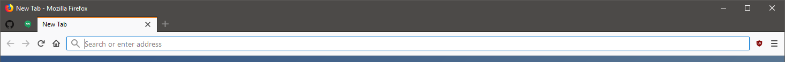

# Firefox Quantum (57+) Compact Restyle

To see Firefox's chrome inspector, see "Browser Toolbox"
https://firefox-source-docs.mozilla.org/devtools-user/browser_toolbox/index.html

This is a work-in-progress and as of right now is built mainly for use in Firefox's "Compact" density mode.

Setting up this repository mainly for my own benefit, but others might find it useful.

## Place contents/clone in:

**Windows**: *C:\\Users\\(user)\\AppData\\Roaming\\Mozilla\\Firefox\\Profiles\\(your profile).default\\chrome\\*  
**Mac**: */Users/(user)/Library/Application Support/Firefox/Profiles/(your profile).default/chrome/*

(Create the "chrome" folder if you don't have one already)

Customize the "windows-ten-os-color" and "accent-color-win" in "/shell/_theme.css". The OS color has to be set manually unfortunately. In Windows 10 this is the color of your title bar, and will appear in the tab bar & behind inactive tabs.

At this point, everything should be styled next time you start up Firefox. With it open, go into "Menu > Customize" and select the "Compact" density, the default theme & check off "Title Bar"

Make a blank "sites.css" file in the chrome folder if you want, and add your own custom css imports there (see userContent.css for more info)
